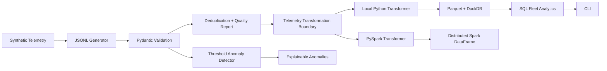

# OrbitOps Data Lab

> From raw satellite telemetry to trusted, queryable, anomaly-aware data.

OrbitOps Data Lab is a deliberately small, production-minded Python project that simulates
spacecraft telemetry and moves it through a complete data workflow: generation, validation,
quality reporting, transformation, Parquet/DuckDB storage, SQL analytics, and explainable
anomaly detection. V2 adds an optional PySpark transformation path without replacing the
lightweight local implementation.

The project is designed as an inspectable engineering portfolio: the codebase, tests,
architecture decisions, feature branches, pull requests, and CI history all demonstrate how the
system was built—not just the final result.

## What This Demonstrates

- Modern Python: typed functions, classes, methods, enums, dataclasses, Pydantic models and protocols
- Clean OOP: composition and small interfaces without pattern-heavy overengineering
- Data engineering: ingestion, validation, deduplication, transformation, Parquet and DuckDB
- Distributed data processing: optional PySpark DataFrame transformations using Spark SQL expressions
- SQL: visible analytical queries rather than hiding logic behind an ORM
- Data quality: malformed rows are quarantined with explicit rejection reasons
- Analytics: deterministic, explainable telemetry anomaly rules
- Testing: unit, parametrized, storage integration, and Spark parity tests
- Engineering workflow: feature branches, Conventional Commits, PR documentation and CI quality gates

## Architecture



**Local data flow:** `Generate → Validate → Transform → Store → Analyze`

The Spark adapter can also transform an existing distributed DataFrame directly, avoiding a
collect-to-driver step when the upstream dataset is already in Spark.

## Quick Start

The base project does not require Spark:

```bash
python -m venv .venv
source .venv/bin/activate
python -m pip install -e .

orbitops generate --satellites 3 --records 1000 --seed 42
orbitops ingest data/raw/telemetry.jsonl
orbitops analyze
```

Expected ingestion summary resembles:

```text
Records received: 1,000
Valid:            972
Invalid:          15
Duplicates:       13
```

Those counts are reproducible for the quick-start defaults (`seed=42`); changing the seed or
injection probabilities changes the quality profile.

## Optional PySpark Path

Install the Spark extra when the distributed transformer is needed:

```bash
python -m pip install -e ".[spark]"
```

PySpark 4.1.x requires Java 17 or later. Development CI provisions Java 17 explicitly and tests
Spark on both supported Python versions.

`SparkTelemetryTransformer.transform(records)` provides parity with the local domain-object
workflow. `transform_frame(frame)` is the distributed path: it applies the same business rules to
an existing Spark DataFrame using built-in column expressions rather than Python UDFs.

### Benchmark Harness

For a local microbenchmark:

```bash
python -m pip install -e ".[dev]"
python benchmarks/benchmark_transformers.py --records 100000 --workers 2
```

The harness reports JVM startup separately from transformation time. It intentionally does not
claim that local-mode Spark should beat pure Python; a production scaling decision should be based
on representative partitioned data and the target cluster environment.

## Project Structure

```text
src/orbitops/
├── analytics/       # anomaly strategies and fleet metrics
├── generation/      # deterministic synthetic telemetry
├── ingestion/       # parsing, validation, deduplication, rejection reporting
├── models/          # strongly typed domain models
├── storage/         # DuckDB repository and Parquet writer
├── transformation/  # local + optional Spark transformation strategies
├── cli.py           # command-line application boundary
└── config.py        # filesystem configuration

benchmarks/           # explicit local-vs-Spark microbenchmark harness

tests/
├── unit/
└── integration/      # storage and Spark integration/parity tests
```

## Testing and Quality Gates

Development checks require Java 17 because the dev dependency set includes the Spark integration
suite:

```bash
make install
make check
```

This runs Ruff linting/format verification, strict mypy analysis and pytest with branch coverage.
CI executes the same gates, including Spark integration tests, on Python 3.11 and 3.12.

## Engineering Decisions

- [Architecture](docs/architecture.md)
- [Telemetry data model](docs/data-model.md)
- [Development workflow](docs/development.md)
- [ADR-001: DuckDB + Parquet](docs/decisions/001-storage-choice.md)
- [ADR-002: Optional PySpark transformation path](docs/decisions/002-pyspark-evolution.md)

## Git Workflow

Substantive changes are developed on focused feature branches and merged through documented pull
requests. Commits use meaningful Conventional Commit-style titles so the repository history remains
an additional engineering artifact rather than an implementation dump.

## Scope

V1 deliberately avoided distributed infrastructure so the engineering fundamentals stayed easy to
inspect. V2 adds one enterprise capability—PySpark—while still avoiding Kafka, Airflow, cloud
infrastructure, and microservices. Those should be introduced only when a concrete orchestration or
scale requirement justifies them.
