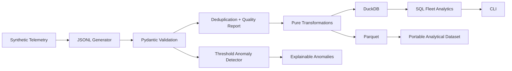

# OrbitOps Data Lab

> From raw satellite telemetry to trusted, queryable, anomaly-aware data.

OrbitOps Data Lab is a deliberately small, production-minded Python project that simulates spacecraft telemetry and moves it through a complete local data workflow: generation, validation, quality reporting, transformation, Parquet/DuckDB storage, SQL analytics, and explainable anomaly detection.

The project is designed as an inspectable engineering portfolio: the codebase, tests, architecture decisions, feature branches, pull requests, and CI history all demonstrate how the system was built—not just the final result.

## What This Demonstrates

- Modern Python: typed functions, classes, methods, enums, dataclasses, Pydantic models and protocols
- Clean OOP: composition and small interfaces without pattern-heavy overengineering
- Data engineering: ingestion, validation, deduplication, transformation, Parquet and DuckDB
- SQL: visible analytical queries rather than hiding logic behind an ORM
- Data quality: malformed rows are quarantined with explicit rejection reasons
- Analytics: deterministic, explainable telemetry anomaly rules
- Testing: unit, parametrized and end-to-end integration tests
- Engineering workflow: feature branches, Conventional Commits, PR documentation and CI quality gates

## Architecture



**Data flow:** `Generate → Validate → Transform → Store → Analyze`

## Quick Start

```bash
python -m venv .venv
source .venv/bin/activate
python -m pip install -e ".[dev]"

orbitops generate --satellites 3 --records 1000 --seed 42
orbitops ingest data/raw/telemetry.jsonl
orbitops analyze
```

Expected ingestion summary resembles:

```text
Records received: 1,000
Valid:            972
Invalid:          15
Duplicates:       13
```

Those counts are reproducible for the quick-start defaults (`seed=42`); changing the seed or injection probabilities changes the quality profile.

## Project Structure

```text
src/orbitops/
├── analytics/       # anomaly strategies and fleet metrics
├── generation/      # deterministic synthetic telemetry
├── ingestion/       # parsing, validation, deduplication, rejection reporting
├── models/          # strongly typed domain models
├── storage/         # DuckDB repository and Parquet writer
├── transformation/  # pure analytics-friendly transformations
├── cli.py           # command-line application boundary
└── config.py        # filesystem configuration

tests/
├── unit/
└── integration/
```

## Testing and Quality Gates

```bash
make check
```

This runs Ruff linting/format verification, strict mypy analysis and pytest with branch coverage. CI executes the same quality gates on Python 3.11 and 3.12.

## Engineering Decisions

- [Architecture](docs/architecture.md)
- [Telemetry data model](docs/data-model.md)
- [Development workflow](docs/development.md)
- [ADR-001: DuckDB + Parquet](docs/decisions/001-storage-choice.md)

## Git Workflow

Substantive changes are developed on focused feature branches and merged through documented pull requests. Commits use meaningful Conventional Commit-style titles so the repository history remains an additional engineering artifact rather than an implementation dump.

## Scope

OrbitOps intentionally avoids cloud infrastructure, Kafka, Spark, Airflow and microservices in its first release. The goal is to make engineering fundamentals easy to inspect before evolving the system with enterprise tooling.
