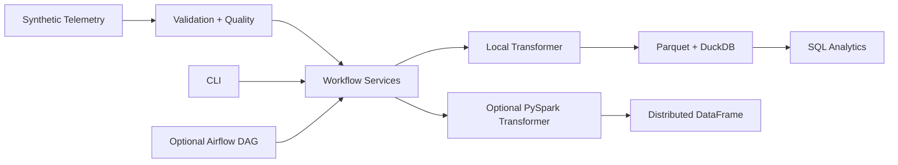

# OrbitOps Data Lab

> From raw satellite telemetry to trusted, queryable, anomaly-aware data.

OrbitOps Data Lab is a deliberately small, production-minded Python project that simulates
spacecraft telemetry and moves it through generation, validation, quality reporting, transformation,
Parquet/DuckDB storage, SQL analytics, and explainable anomaly detection. V2 adds an optional PySpark
transformation path. V3 adds optional Apache Airflow orchestration without moving application logic
into DAG files.

The project is designed as an inspectable engineering portfolio: the codebase, tests, architecture
decisions, feature branches, pull requests, and CI history demonstrate how the system evolved—not
just the final result.

## What This Demonstrates

- Modern Python: typed functions, classes, methods, enums, dataclasses, Pydantic models and protocols
- Clean OOP: composition and small interfaces without pattern-heavy overengineering
- Data engineering: ingestion, validation, deduplication, transformation, Parquet and DuckDB
- Distributed processing: optional PySpark DataFrame transformations using Spark SQL expressions
- Orchestration: Airflow 3 TaskFlow DAGs with schedules, retries, concurrency and explicit dependencies
- SQL: visible analytical queries rather than hiding logic behind an ORM
- Data quality: malformed rows are quarantined with explicit rejection reasons
- Testing: unit, storage integration, Spark parity, and real Airflow DAG-loading checks
- Engineering workflow: stacked feature branches, Conventional Commits, documented PRs and CI gates

## Architecture



**Local flow:** `Generate → Validate → Transform → Store → Analyze`

The CLI and Airflow DAG are delivery/orchestration interfaces over the same workflow services. Spark
remains a separate transformation choice rather than being implicitly required by orchestration.

## Quick Start

The base project requires neither Spark nor Airflow:

```bash
python -m venv .venv
source .venv/bin/activate
python -m pip install -e .

orbitops generate --satellites 3 --records 1000 --seed 42
orbitops ingest data/raw/telemetry.jsonl
orbitops analyze
```

## Optional PySpark Path

```bash
python -m pip install -e ".[spark]"
```

`SparkTelemetryTransformer.transform_frame(frame)` applies the derived-field rules to an existing
Spark DataFrame using built-in column expressions rather than Python UDFs. See
[ADR-002](docs/decisions/002-pyspark-evolution.md) for the tradeoffs.

## Optional Airflow Orchestration

Airflow is intentionally installed as a separate orchestration runtime using Apache's constraints
rather than as an OrbitOps package dependency:

```bash
python -m venv .airflow-venv
source .airflow-venv/bin/activate
./scripts/install_airflow.sh

export AIRFLOW_HOME="$(pwd)/.airflow"
export AIRFLOW__CORE__DAGS_FOLDER="$(pwd)/dags"
export ORBITOPS_DATA_DIR="$(pwd)/data/airflow"
airflow standalone
```

`airflow standalone` is useful for local development/demo use, not a production deployment model.
The example DAG is `orbitops_telemetry_pipeline` and schedules a three-task graph:

```text
generate -> process -> summarize
```

The DAG uses Airflow 3's stable `airflow.sdk` interface and passes only compact metadata through task
outputs. The actual ETL remains in `orbitops.workflows.telemetry`, which is shared with the CLI.

## Project Structure

```text
dags/                 # thin Airflow orchestration definitions
src/orbitops/
├── analytics/        # anomaly strategies and fleet metrics
├── generation/       # deterministic synthetic telemetry
├── ingestion/        # validation, deduplication and rejection reporting
├── models/           # strongly typed domain models
├── storage/          # DuckDB repository and Parquet writer
├── transformation/   # local + optional Spark transformation strategies
├── workflows/        # framework-neutral application workflow services
├── cli.py            # command-line interface
└── config.py         # filesystem configuration

benchmarks/            # local-vs-Spark microbenchmark harness
scripts/               # reproducible orchestration setup helpers

tests/
├── airflow/           # Airflow DAG-structure tests
├── integration/       # storage and Spark integration/parity tests
└── unit/
```

## Testing and Quality Gates

The main quality matrix runs on Python 3.11 and 3.12 with Java 17 for the Spark integration suite.
A separate Airflow matrix installs Airflow 3.3.0 with its official per-Python constraints and checks:

- dependency consistency with `pip check`
- metadata database migration
- zero DAG import errors
- expected task discovery
- Airflow DAG-structure tests

## Engineering Decisions

- [Architecture](docs/architecture.md)
- [Telemetry data model](docs/data-model.md)
- [Development workflow](docs/development.md)
- [ADR-001: DuckDB + Parquet](docs/decisions/001-storage-choice.md)
- [ADR-002: Optional PySpark transformation](docs/decisions/002-pyspark-evolution.md)
- [ADR-003: Optional Airflow orchestration](docs/decisions/003-airflow-orchestration.md)

## Evolution Strategy

- **V1 / `main`** — production-minded Python and local analytical workflow.
- **V2 / draft branch** — optional PySpark transformation as a scaling decision.
- **V3 / stacked draft branch** — optional Airflow orchestration as an operational decision.

Neither V2 nor V3 needs to be merged for the repository history to demonstrate the design choices.
Keeping the branches separate also makes it possible to discuss why a workload might need Spark,
Airflow, both, or neither.
